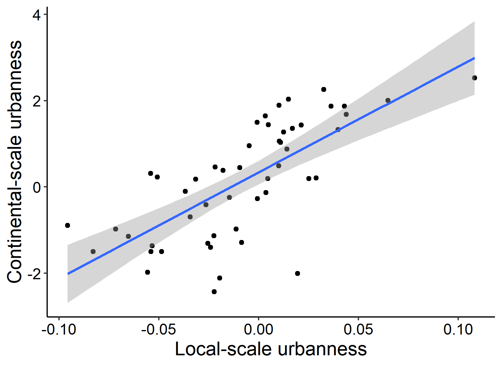
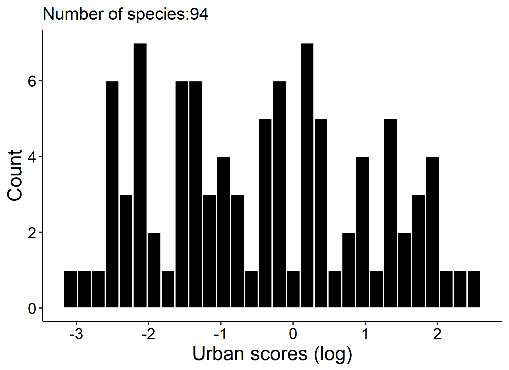

\newpage

# Abstract

https://www.youtube.com/embed/b4gTClz50yE

*Keywords*: citizen science; species-environment relationships; spatial scales; urbanization; urban ecology; eBird

\newpage
# Introduction
Understanding species-environment relationships [@mertes2018disentangling] is a critical and unifying goal in ecology [@hutchinson1953concept; @levin1992problem], biogeography [@currie1987large; @hawkins2003energy], and conservation [@guisan2013predicting; @duflot2018combining]. A thorough and generalized understanding of how species respond to their environment should translate to an increased ability to mitigate potential threats, ultimately preserving biodiversity [@paterson2008mitigation; @tilman2017future]. Chief among these potential threats are anthropogenic changes [@tilman1999ecological; @hautier2015anthropogenic], such as climate change [@hampe2005conserving], species invasions [@ricciardi2017invasion], and land use changes [@vandewalle2010functional]. Yet the scale-dependence of species-environment relationships remains complex and poorly unresolved [@mertes2018disentangling]: for example, 10% of studies show biodiversity changes which switch directions across scales [@chase2018embracing]. Empirical analyses are desperately needed to inform our understanding on the patterns and mechanisms relating to scale-dependence of species-environment relationships [@holland2004determining].

By 2030, 10% of the earth's landmass is projected to be urbanized [@elmqvist2013urbanization], making increasing urbanization --- and its associated habitat loss, fragmentation, and degradation --- a significant anthropogenic threat to the world's biodiversity [@elmqvist2016urbanization; @sanderson2018bottleneck]. Much research has informed our understanding of the negative impacts of urbanization on biodiversity [@mckinney2002urbanization; @mcdonald2008implications; @vimal2012detecting; @huang2018importance], but this understanding is still lacking unified theories across spatial scales and repeatable methods.

Our current understanding of spatial-scale dependence of biodiversity responses to land-use are most common for aggregated biodiversity metrics [@gotelli2001quantifying], including: species richness [@whittaker2001scale; @weibull2003species; @diniz2005modelling; @mckinney2008effects; @concepcion2016impacts; @zellweger2016environmental], various measures of species diversity [@he1996spatial; @meynard2011beyond; @morlon2011spatial; @roeselers2015microbial; @salazar2016global], or other functional groupings [@devictor2008functional; @clavel2011worldwide; @gamez2015landscape; @deguines2016functional]. Specific to urbanization impacts on birds, a priori grouping of species is common. For example, grouping species based on urban avoiders, urban adapters, and urban exploiters [@mckinney2002urbanization; @mckinney2006urbanization; @kark2007living; @mcdonnell2015adaptation; @geschke2018compact], or even based on presence/absence within urban environments [@bonier2007urban; @moller2009successful]. While this approach is analytically and conceptually simple, it assumes that species within groups respond equally [@lepczyk2008human; @evans2011makes], limiting our understanding of the complex mechanisms influencing how organisms respond to their environment. Indeed, characterizing how biodiversity responds to its environment should be species-specific [@ewers2006confounding; @cushman2006effects; @mcgarigal2016multi; @vargas2017species; @mertes2018disentangling], particularly for anthropogenic land use changes [@suarez2002large], such as urbanization [@gehrt2004species; @russo2015sensitivity].

A traditional hurdle in providing species-specific responses to their environment at various spatial scales has been the cost of data collection: it is expensive to collect voluminous amount of data at the necessary spatial and temporal scales to make generalizable inferences. This hurdle necessarily limits the spatial scale of a particular study as well as the number of species being investigated. Fortunately, we now have access to broad-scale empirical datasets numbering millions of observations --- generally collected through citizen science programs [e.g., @sullivan2009ebird; @prudic2017ebutterfly; @van2018inaturalist] --- revolutionizing ecological and conservation research [@cooper2007citizen; @silvertown2009new; @pocock2018vision]. Simultaneously, the field of remote sensing is rapidly advancing [@kwok2018ecology], with increasing numbers of sensors, targeted missions for ecology [@wikelski2007going; @bioucas2013hyperspectral; @jetz2016monitoring], freely available data, and improved access to data analysis pipelines  [@gorelick2017google; @murray2018remap]. These biodiversity data combined with remotely sensed data are increasing our understanding of biodiversity responses to environmental change [@pettorelli2014satellite; @pettorelli2014satellitea; @pettorelli2016framing].

We aim to form a unified understanding of how bird species respond to urbanization across spatial scales. We test whether species-specific responses to urbanization at continental spatial scales predict species-specific responses to urbanization at local scales. To do so, we integrate broad-scale biodiversity data --- collected through one particularly successful citizen science project: eBird [@sullivan2009ebird; @wood2011ebird; @sullivan2014ebird] --- with local-level bird surveys within small cities, nestled within a World Heritage Area.

# Methods
## Continental species-specific responses to urbanization
### eBird data
eBird [@sullivan2009ebird; @wood2011ebird; @sullivan2014ebird; @callaghan2015efficacy], launched in 2002 by the Cornell Lab of Ornithology, has > 600 million global observations, and formed the data-basis of the continental species-specific responses. eBird works by enlisting volunteer birdwatchers who submit bird observations in the form of 'checklists' --- defined as a list of birds seen or heard. An extensive network of regional volunteers [@gilfedder2018brokering] use their local expertise to provide filters for the submissions, limiting observations based on unexpected species or abundances of species. If an observation trips a filter than it is reviewed before inclusion in the database.

### Species-specific scores
We used previously published species-specific responses to urbanization. These were calculated by: (1) filtering eBird data to the best quality lists [e.g., @la2014role; @callaghan2017assessing]; (2) assigning each eBird checklist's spatiotemporal coordinates a continuous measure of urbanization, using VIIRS night-time lights [@elvidge2017viirs] as a proxy for urbanization, using google earth engine [@gorelick2017google]; and (3) the species-specific scores were then taken as the median of a species distributional response to urbanization. For full details, and a published list of species-specific urban scores, see Callaghan et al. [-@callaghan2019generalists]. Note that exotic species were excluded from Callaghan et al. 2019, but were included in this analysis.

## Local-scale species-specific responses to urbanization
We conducted bird-surveys within the Greater Blue Mountains World Heritage Area (GBWHA), which is 10,000 $km^{2}$ and lies about 180 km from Sydney, New South Wales, Australia. Within the GBWHA is a strip of linear conurbation consisting of a small number of cities. We designed transects at each of four cities within this conurbation (Fig. S1). Points were spaced ~ 500 meters apart on each transect. Woodford, Lawson, and Hazelbrook had 5 points each, while Katoomba had 9 points (Fig. S1). Between August 2017 and August 2018, transects were visited twice per month (N=576), and 5-minute point-counts were conducted at each point. All birds seen or heard within 250 meters of the point were counted. Surveys were conducted on days where the weather would have a minimal effect, and surveys were completed between sunrise and 5 hours after sunrise. Transects, as well as order of transects was randomly completed so that the same transect was not being conducted first every month. We estimated urbanization at each point as the percent impervious within a 250 m radius buffer surrounding that point, using recent aerial photography from Google Earth Pro.

In order to extract relative species-specific responses to urbanization at a local scale, we modelled the number of observations of a species against the percent impervious area at each survey point. We fitted generalized linear models mixed models with a Poisson distribution, where the random effect was transect (i.e., city). This model was fitted to each species, and the parameter estimate for a given species was taken as the species-specific response to urbanzation at a local scale. Models were fit using the 'glmer' function from lme4 [@bates2015fitting].

## Regression of continental and local-scale urban-measures
A total of 93 species were observed (Appendix S2) on our local-scale bird surveys, but many of these were observed few times. As such, we used the deviance explained for each species as a measure of model fit, and any species which had a deviance explained of < 15 were eliminated from analysis. We were left with 51 species which model fits had a deviance of > 15. These 51 species' local-scale urban scores were regressed against their log-transformed continental urban scores, using the lm function in R.

## Data accessibility
All analyses were performed within the R statistical environment [@rcoreteam2018], and relied heavily on the tidyverse workflow [@tidyverse2017]. Code and data necessary are available in a github repository and will be made available upon acceptance on this article as a permanently archived zenodo repository.

# Results
The mean urban score for the 94 potential species included in the analysis was 1.64 $\pm$ 2.36 (Figure S2). Rock Pigeon had the highest urban score (12.49) as well as the strongest parameter estimate from the generalized linear model (0.18). The relationship between continental-scale urbanness and local-scale response to urbanization was significant for the 52 species which were analyzed (t=7.055, dF=49, p < 0.001), with an adjusted $R^{2}$ of 0.49.

# Discussion
Our results suggest that continental-scale responses to urbanization can predict local-scale responses to urbanization. These results suggest that urbanization is a unifying threat, equally detrimental across spatial scales.

City-size is a potentially important predictor in mediating species-responses to urbanization [citation]. Therefore, understanding how city-size impacts urbanization is important for mitigating the threat of urbanization. However, our results suggest that species-responses seen at broad-spatial scales (i.e., over entire distributions) are likely to be representative of responses at local-scales.

We also provide a methodological enhancement, validating a method with which to calculate intra-specific variation in measuring responses to urbanization. This method moves past the traditional notion of grouping species based on response to urbanization and informing management based on these groupings. Although, we note that you can indeed cluster species into those which respond to urbanization positively, negatively, and show mixed responses. The difference, however, is that these grouping are informed and incorporate the inter-specific variation which exists.

Citizen science data is radically shaping the spatial and temporal scale with which ecological questions are being answered [citations], and this is particularly true within urban areas []. Our results confirm that macroecological studies, focused on broad-scale responses of species to their environment are confirmed using local-scale responses to the same aspect of their environment.

Although our analysis is focused on species-specific responses to urbanization, we highlight that the procedures can be repeated with other environmental factors (e.g., tree-cover, water-cover).


# Acknowledgements
We thank the Australian Wildlife Society for providing funding for this work. Mark Ley, Simon Gorta, and Max Breckenridge were instrumental in conducting surveys.

\newpage

# References

<div id="refs"></div>

\newpage

# Figures

```{r Figure 1, echo=FALSE, fig.cap="Regression of log-transformed continental-scale urbanness versus local-scale urbanness for 51 species."}
library(knitr)

```

\newpage
# Supplementary figures
```{r Figure S1, echo=FALSE, fig.cap="A map of the study area, located in the Blue Mountain World Heritage area, ~ 180 km west of Sydney, New South Wales, Australia."}
library(knitr)
knitr::include_graphics("Figures/map_figure.pdf")
```


```{r Figure S2, echo=FALSE, fig.cap="Histogram of the urban scores for the 94 species."}
library(knitr)

```
